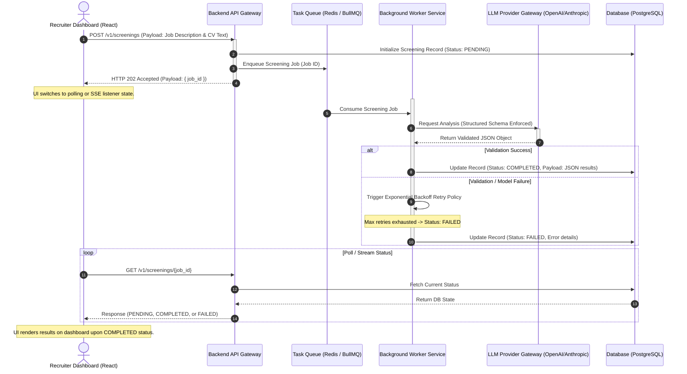

# ai-resume-matcher-tdd
Technical Design Document (TDD) for a scalable, multi-tenant AI Resume Screening system featuring asynchronous task processing and structured LLM validation.

# AI Resume Matcher — Technical Design Document (TDD)

This repository contains the Technical Design Document (TDD) for the **AI Resume Screening** feature. It outlines an asynchronous, highly scalable, and multi-tenant ready architecture designed for an AI-powered CRM startup.

---

## 1. System Architecture & End-to-End Data Flow

The diagram below outlines the asynchronous processing pipeline engineered to handle variable LLM latencies without blocking client-facing web servers.

### Step-by-Step Architecture Breakdown & Deep Dive

The numbered sequence in the diagram maps to the following lifecycle phases:

#### Phase A: Ingestion & Decoupling (Steps 1–4)
* **Step 1: Ingestion Pipeline**: The client (React) transmits the plaintext raw payload containing the Job Description and CV text via a `POST /v1/screenings` request.
* **Step 2: State Persistence**: The API Gateway sanitizes the input and writes an initial record to the PostgreSQL database with a status of `PENDING`. This guarantees audit trails even if subsequent downstream workers experience catastrophic failures.
* **Step 3: Message Queueing**: The API Gateway publishes a lightweight job containing only the `job_id` to a Redis/BullMQ instance. This keeps the core API stateless and prevents long-lived connections.
* **Step 4: Non-Blocking Acknowledgment**: The API instantly releases the HTTP thread back to the client with an **HTTP 202 Accepted** status and the `job_id`. The UI immediately updates to show a loading state without locking up the user interface.

#### Phase B: Background Processing & LLM Execution (Steps 5–10)
* **Step 5: Job Consumption**: A worker pool service pulls the pending event payload off the Redis queue.
* **Step 6: LLM Gateway Invocation**: The worker dynamically fetches prompt templates, dynamically builds the execution context, and acts as a client wrapper to dispatch the payload to the LLM Gateway with an enforced strict JSON schema.
* **Step 7: Deterministic Output Ingestion**: The LLM streams or sends back a response object validating perfectly against our pre-compiled JSON schema structure.
* **Step 8: Success Branch (Alt)**: Upon valid structural data ingestion, the worker updates the database record state to `COMPLETED` and dumps the highly structured compatibility breakdown to the database.
* **Steps 9 & 10: Fault Tolerance Branch (Alt)**: If the response is malformed or an API timeout hits, an exponential backoff retry loop activates. If it completely exhausts retries, Step 10 updates the state to `FAILED` with system error contexts to ensure observability.

#### Phase C: State Reconciliation (Steps 11–14)
* **Step 11: Polling / Event Stream Loop**: The React application runs a micro-polling lifecycle using standard intervals or relies on Server-Sent Events targeting `GET /v1/screenings/{job_id}`.
* **Steps 12 & 13: Database Read Phase**: The API processes incoming check requests by fetching the single database state by its indexed ID.
* **Step 14: Final Client Update**: The API returns the execution payload. Once the client intercepts a `COMPLETED` state, the React UI stops the loop and immediately paints the interactive analytics dashboard component for the recruiter.
